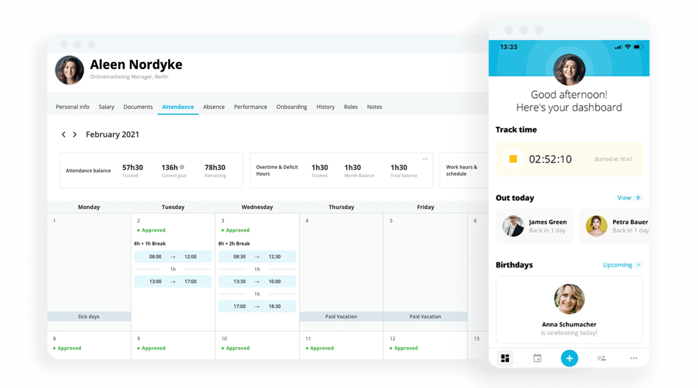

<div align="left">

[](https://personio.com)

# Personio<a id="personio"></a>

API for reading and writing personnel data including data about attendances, absences, documents, etc


</div>

## Table of Contents<a id="table-of-contents"></a>

<!-- toc -->

- [Requirements](#requirements)
- [Installation](#installation)
- [Getting Started](#getting-started)
- [Async](#async)
- [Raw HTTP Response](#raw-http-response)
- [Reference](#reference)
  * [`personiodata.absences.add_absence_data`](#personiodataabsencesadd_absence_data)
  * [`personiodata.absences.add_absence_periods_data`](#personiodataabsencesadd_absence_periods_data)
  * [`personiodata.absences.delete_absence_data`](#personiodataabsencesdelete_absence_data)
  * [`personiodata.absences.delete_period_data`](#personiodataabsencesdelete_period_data)
  * [`personiodata.absences.get_absence_period`](#personiodataabsencesget_absence_period)
  * [`personiodata.absences.get_absence_periods`](#personiodataabsencesget_absence_periods)
  * [`personiodata.absences.get_hourly_periods`](#personiodataabsencesget_hourly_periods)
  * [`personiodata.absences.list_time_off_types`](#personiodataabsenceslist_time_off_types)
  * [`personiodata.attendances.create_multiple_attendances`](#personiodataattendancescreate_multiple_attendances)
  * [`personiodata.attendances.delete_data`](#personiodataattendancesdelete_data)
  * [`personiodata.attendances.get_list`](#personiodataattendancesget_list)
  * [`personiodata.attendances.update_attendance_data`](#personiodataattendancesupdate_attendance_data)
  * [`personiodata.custom_reports.get_column_labels`](#personiodatacustom_reportsget_column_labels)
  * [`personiodata.custom_reports.get_data`](#personiodatacustom_reportsget_data)
  * [`personiodata.custom_reports.get_metadata`](#personiodatacustom_reportsget_metadata)
  * [`personiodata.documents.get_categories`](#personiodatadocumentsget_categories)
  * [`personiodata.documents.upload_for_employees`](#personiodatadocumentsupload_for_employees)
  * [`personiodata.employees.create_employee`](#personiodataemployeescreate_employee)
  * [`personiodata.employees.get_absence_balance`](#personiodataemployeesget_absence_balance)
  * [`personiodata.employees.get_custom_attributes`](#personiodataemployeesget_custom_attributes)
  * [`personiodata.employees.get_list`](#personiodataemployeesget_list)
  * [`personiodata.employees.list_attributes`](#personiodataemployeeslist_attributes)
  * [`personiodata.employees.show_by_id`](#personiodataemployeesshow_by_id)
  * [`personiodata.employees.show_profile_picture`](#personiodataemployeesshow_profile_picture)
  * [`personiodata.employees.update_employee_fields`](#personiodataemployeesupdate_employee_fields)
  * [`personiodata.projects.create_project`](#personiodataprojectscreate_project)
  * [`personiodata.projects.delete_project`](#personiodataprojectsdelete_project)
  * [`personiodata.projects.get_all`](#personiodataprojectsget_all)
  * [`personiodata.projects.update_data`](#personiodataprojectsupdate_data)

<!-- tocstop -->

## Requirements<a id="requirements"></a>

Python >=3.7

## Installation<a id="installation"></a>
<div align="center">
  <a href="https://konfigthis.com/sdk-sign-up?company=Personio&serviceName=Data&language=Python">
    
  </a>
</div>

## Getting Started<a id="getting-started"></a>

```python
from pprint import pprint
from personio_data_python_sdk import PersonioData, ApiException

personiodata = PersonioData(

    access_token = 'YOUR_BEARER_TOKEN'
)

try:
    add_absence_data_response = personiodata.absences.add_absence_data(
        employee_id=1,
        time_off_type_id=1,
        start_date="2020-01-31",
        end_date="2020-01-31",
        half_day_start=False,
        half_day_end=False,
        x_personio_partner_id="string_example",
        x_personio_app_id="string_example",
        comment="Some Comment",
        skip_approval=False,
    )
    print(add_absence_data_response)
except ApiException as e:
    print("Exception when calling AbsencesApi.add_absence_data: %s\n" % e)
    pprint(e.body)
    if e.status == 400:
        pprint(e.body["success"])
        pprint(e.body["error"])
    if e.status == 422:
        pprint(e.body["success"])
        pprint(e.body["error"])
    if e.status == 404:
        pprint(e.body["success"])
        pprint(e.body["error"])
    pprint(e.headers)
    pprint(e.status)
    pprint(e.reason)
    pprint(e.round_trip_time)
```

## Async<a id="async"></a>

`async` support is available by prepending `a` to any method.

```python

import asyncio
from pprint import pprint
from personio_data_python_sdk import PersonioData, ApiException

personiodata = PersonioData(

    access_token = 'YOUR_BEARER_TOKEN'
)

async def main():
    try:
        add_absence_data_response = await personiodata.absences.aadd_absence_data(
            employee_id=1,
            time_off_type_id=1,
            start_date="2020-01-31",
            end_date="2020-01-31",
            half_day_start=False,
            half_day_end=False,
            x_personio_partner_id="string_example",
            x_personio_app_id="string_example",
            comment="Some Comment",
            skip_approval=False,
        )
        print(add_absence_data_response)
    except ApiException as e:
        print("Exception when calling AbsencesApi.add_absence_data: %s\n" % e)
        pprint(e.body)
        if e.status == 400:
            pprint(e.body["success"])
            pprint(e.body["error"])
        if e.status == 422:
            pprint(e.body["success"])
            pprint(e.body["error"])
        if e.status == 404:
            pprint(e.body["success"])
            pprint(e.body["error"])
        pprint(e.headers)
        pprint(e.status)
        pprint(e.reason)
        pprint(e.round_trip_time)

asyncio.run(main())
```

## Raw HTTP Response<a id="raw-http-response"></a>

To access raw HTTP response values, use the `.raw` namespace.

```python
from pprint import pprint
from personio_data_python_sdk import PersonioData, ApiException

personiodata = PersonioData(

    access_token = 'YOUR_BEARER_TOKEN'
)

try:
    add_absence_data_response = personiodata.absences.raw.add_absence_data(
        employee_id=1,
        time_off_type_id=1,
        start_date="2020-01-31",
        end_date="2020-01-31",
        half_day_start=False,
        half_day_end=False,
        x_personio_partner_id="string_example",
        x_personio_app_id="string_example",
        comment="Some Comment",
        skip_approval=False,
    )
    pprint(add_absence_data_response.body)
    pprint(add_absence_data_response.body["data"])
    pprint(add_absence_data_response.headers)
    pprint(add_absence_data_response.status)
    pprint(add_absence_data_response.round_trip_time)
except ApiException as e:
    print("Exception when calling AbsencesApi.add_absence_data: %s\n" % e)
    pprint(e.body)
    if e.status == 400:
        pprint(e.body["success"])
        pprint(e.body["error"])
    if e.status == 422:
        pprint(e.body["success"])
        pprint(e.body["error"])
    if e.status == 404:
        pprint(e.body["success"])
        pprint(e.body["error"])
    pprint(e.headers)
    pprint(e.status)
    pprint(e.reason)
    pprint(e.round_trip_time)
```


## Reference<a id="reference"></a>
### `personiodata.absences.add_absence_data`<a id="personiodataabsencesadd_absence_data"></a>

Adds absence data for absence types with **time unit** set to **days**.

#### 🛠️ Usage<a id="🛠️-usage"></a>

```python
add_absence_data_response = personiodata.absences.add_absence_data(
    employee_id=1,
    time_off_type_id=1,
    start_date="2020-01-31",
    end_date="2020-01-31",
    half_day_start=False,
    half_day_end=False,
    x_personio_partner_id="string_example",
    x_personio_app_id="string_example",
    comment="Some Comment",
    skip_approval=False,
)
```

#### ⚙️ Parameters<a id="⚙️-parameters"></a>

##### employee_id: `int`<a id="employee_id-int"></a>

Employee identifier

##### time_off_type_id: `int`<a id="time_off_type_id-int"></a>

Time-off type identifier

##### start_date: `date`<a id="start_date-date"></a>

Absence start date. Format: yyyy-mm-dd

##### end_date: `date`<a id="end_date-date"></a>

Absence end date. Format: yyyy-mm-dd

##### half_day_start: `bool`<a id="half_day_start-bool"></a>

Whether the start date is a half-day off.

##### half_day_end: `bool`<a id="half_day_end-bool"></a>

Whether the end date is a half-day off.

##### x_personio_partner_id: `str`<a id="x_personio_partner_id-str"></a>

The partner identifier

##### x_personio_app_id: `str`<a id="x_personio_app_id-str"></a>

The application identifier

##### comment: `str`<a id="comment-str"></a>

Optional comment

##### skip_approval: `bool`<a id="skip_approval-bool"></a>

Optional, default value is true. If set to false, the approval status of the absence request will be \\\"pending\\\" if an approval rule is set for the absence type in Personio. The respective approval flow will be triggered.

#### ⚙️ Request Body<a id="⚙️-request-body"></a>

[`CreateTimeOffPeriodRequest`](./personio_data_python_sdk/type/create_time_off_period_request.py)
Absence data

#### 🔄 Return<a id="🔄-return"></a>

[`AbsencesAddAbsenceDataResponse`](./personio_data_python_sdk/pydantic/absences_add_absence_data_response.py)

#### 🌐 Endpoint<a id="🌐-endpoint"></a>

`/company/time-offs` `post`

[🔙 **Back to Table of Contents**](#table-of-contents)

---

### `personiodata.absences.add_absence_periods_data`<a id="personiodataabsencesadd_absence_periods_data"></a>

Adds absence data for absence types with **time unit** set to **hours**. Note that creating periods for absence types with certificate requirement enabled is not supported!

#### 🛠️ Usage<a id="🛠️-usage"></a>

```python
add_absence_periods_data_response = personiodata.absences.add_absence_periods_data(
    employee_id=10735,
    time_off_type_id=10735,
    start_date="2020-01-31",
    end_date="2020-01-31",
    x_personio_partner_id="string_example",
    x_personio_app_id="string_example",
    start_time="03:00",
    end_time="900",
    half_day_start=False,
    half_day_end=False,
    comment="Some Comment",
    skip_approval=False,
)
```

#### ⚙️ Parameters<a id="⚙️-parameters"></a>

##### employee_id: `int`<a id="employee_id-int"></a>

Employee identifier

##### time_off_type_id: `int`<a id="time_off_type_id-int"></a>

Time-off type identifier

##### start_date: `date`<a id="start_date-date"></a>

Absence start date. Format: yyyy-mm-dd

##### end_date: `date`<a id="end_date-date"></a>

Absence end date. Format: yyyy-mm-dd

##### x_personio_partner_id: `str`<a id="x_personio_partner_id-str"></a>

The partner identifier

##### x_personio_app_id: `str`<a id="x_personio_app_id-str"></a>

The application identifier

##### start_time: `date`<a id="start_time-date"></a>

Absence start time. Format: HH:mm (hours and minutes) and only required if the start_date and end_date are the same (partial-day absence)

##### end_time: `date`<a id="end_time-date"></a>

Absence end time. Format: HH:mm (hours and minutes) and only required if the start_date and end_date are the same (partial-day absence)

##### half_day_start: `bool`<a id="half_day_start-bool"></a>

Whether the start date is a half-day off, only considered if the start_date and end_date are not the same (more than one day absence)

##### half_day_end: `bool`<a id="half_day_end-bool"></a>

Whether the end date is a half-day off, only considered if the start_date and end_date are not the same (more than one day absence)

##### comment: `str`<a id="comment-str"></a>

Optional comment

##### skip_approval: `bool`<a id="skip_approval-bool"></a>

Optional, default value is true. If set to false, the approval status of the absence request will be \\\"pending\\\" if an approval rule is set for the absence type in Personio. The respective approval flow will be triggered.

#### ⚙️ Request Body<a id="⚙️-request-body"></a>

[`CreateAbsencePeriodRequest`](./personio_data_python_sdk/type/create_absence_period_request.py)
Absence data

#### 🔄 Return<a id="🔄-return"></a>

[`AbsencesAddAbsencePeriodsDataResponse`](./personio_data_python_sdk/pydantic/absences_add_absence_periods_data_response.py)

#### 🌐 Endpoint<a id="🌐-endpoint"></a>

`/company/absence-periods` `post`

[🔙 **Back to Table of Contents**](#table-of-contents)

---

### `personiodata.absences.delete_absence_data`<a id="personiodataabsencesdelete_absence_data"></a>

Deletes absence period data for absence types with **time unit** set to **days**.

#### 🛠️ Usage<a id="🛠️-usage"></a>

```python
delete_absence_data_response = personiodata.absences.delete_absence_data(
    id=1,
    x_personio_partner_id="string_example",
    x_personio_app_id="string_example",
)
```

#### ⚙️ Parameters<a id="⚙️-parameters"></a>

##### id: `int`<a id="id-int"></a>

ID of the absence period to delete

##### x_personio_partner_id: `str`<a id="x_personio_partner_id-str"></a>

The partner identifier

##### x_personio_app_id: `str`<a id="x_personio_app_id-str"></a>

The application identifier

#### 🔄 Return<a id="🔄-return"></a>

[`DeletedAbsenceResponse`](./personio_data_python_sdk/pydantic/deleted_absence_response.py)

#### 🌐 Endpoint<a id="🌐-endpoint"></a>

`/company/time-offs/{id}` `delete`

[🔙 **Back to Table of Contents**](#table-of-contents)

---

### `personiodata.absences.delete_period_data`<a id="personiodataabsencesdelete_period_data"></a>

Deletes absence period data for absence types with **time unit** set to **hours**.

#### 🛠️ Usage<a id="🛠️-usage"></a>

```python
delete_period_data_response = personiodata.absences.delete_period_data(
    id="61fe126b-a7b3-449a-b5ee-3865a6fcc546",
    x_personio_partner_id="string_example",
    x_personio_app_id="string_example",
)
```

#### ⚙️ Parameters<a id="⚙️-parameters"></a>

##### id: `str`<a id="id-str"></a>

ID of the absence period to delete

##### x_personio_partner_id: `str`<a id="x_personio_partner_id-str"></a>

The partner identifier

##### x_personio_app_id: `str`<a id="x_personio_app_id-str"></a>

The application identifier

#### 🔄 Return<a id="🔄-return"></a>

[`DeletedAbsenceResponse`](./personio_data_python_sdk/pydantic/deleted_absence_response.py)

#### 🌐 Endpoint<a id="🌐-endpoint"></a>

`/company/absence-periods/{id}` `delete`

[🔙 **Back to Table of Contents**](#table-of-contents)

---

### `personiodata.absences.get_absence_period`<a id="personiodataabsencesget_absence_period"></a>

Gets an absence period for absences with **time unit** set to **days**.

#### 🛠️ Usage<a id="🛠️-usage"></a>

```python
get_absence_period_response = personiodata.absences.get_absence_period(
    id=1,
    x_personio_partner_id="string_example",
    x_personio_app_id="string_example",
)
```

#### ⚙️ Parameters<a id="⚙️-parameters"></a>

##### id: `int`<a id="id-int"></a>

Numeric `id` of the absence period

##### x_personio_partner_id: `str`<a id="x_personio_partner_id-str"></a>

The partner identifier

##### x_personio_app_id: `str`<a id="x_personio_app_id-str"></a>

The application identifier

#### 🔄 Return<a id="🔄-return"></a>

[`AbsencePeriodResponse`](./personio_data_python_sdk/pydantic/absence_period_response.py)

#### 🌐 Endpoint<a id="🌐-endpoint"></a>

`/company/time-offs/{id}` `get`

[🔙 **Back to Table of Contents**](#table-of-contents)

---

### `personiodata.absences.get_absence_periods`<a id="personiodataabsencesget_absence_periods"></a>

Fetches absence periods for absences with **time unit** set to **days**. The result can be `paginated` and `filtered` by period and/or specific employee/employees. The result contains a list of absence periods.

#### 🛠️ Usage<a id="🛠️-usage"></a>

```python
get_absence_periods_response = personiodata.absences.get_absence_periods(
    x_personio_partner_id="string_example",
    x_personio_app_id="string_example",
    start_date="1970-01-01",
    end_date="1970-01-01",
    updated_from="1970-01-01",
    updated_to="1970-01-01",
    employees_=[
        1
    ],
    limit=200,
    offset=0,
)
```

#### ⚙️ Parameters<a id="⚙️-parameters"></a>

##### x_personio_partner_id: `str`<a id="x_personio_partner_id-str"></a>

The partner identifier

##### x_personio_app_id: `str`<a id="x_personio_app_id-str"></a>

The application identifier

##### start_date: `date`<a id="start_date-date"></a>

First day of the period to be queried. It is inclusive, so the result starts from and including the provided `start_date`

##### end_date: `date`<a id="end_date-date"></a>

Last day of the period to be queried. It is inclusive, so the result ends on `end_date` including absences from the `end_date`

##### updated_from: `date`<a id="updated_from-date"></a>

Query the periods that created or modified from the date `updated_from`. It is inclusive, so all the periods created or modified from the beginning of the `updated_from` will be included in the results

##### updated_to: `date`<a id="updated_to-date"></a>

Query the periods that created or modified until the date `updated_to`. It is inclusive, so all the periods created or modified until the end of the `updated_to` will be included in the results

##### employees_: List[`int`]<a id="employees_-listint"></a>

A list of Personio employee ID's to filter the results. The result filters including only absences of provided employees

##### limit: `int`<a id="limit-int"></a>

Pagination attribute to limit the number of absence periods per page

##### offset: `int`<a id="offset-int"></a>

Pagination attribute to identify which page number you are requesting

#### 🔄 Return<a id="🔄-return"></a>

[`AbsencePeriodsResponse`](./personio_data_python_sdk/pydantic/absence_periods_response.py)

#### 🌐 Endpoint<a id="🌐-endpoint"></a>

`/company/time-offs` `get`

[🔙 **Back to Table of Contents**](#table-of-contents)

---

### `personiodata.absences.get_hourly_periods`<a id="personiodataabsencesget_hourly_periods"></a>

Fetches absence periods for absences with **time unit** set to **hours**. The result can be `paginated` and `filtered` by period and/or specific employee/employees. The result contains a list of hourly absence periods.

#### 🛠️ Usage<a id="🛠️-usage"></a>

```python
get_hourly_periods_response = personiodata.absences.get_hourly_periods(
    x_personio_partner_id="string_example",
    x_personio_app_id="string_example",
    start_date="1970-01-01",
    end_date="1970-01-01",
    updated_from="1970-01-01T00:00:00.00Z",
    updated_to="1970-01-01T00:00:00.00Z",
    employees_=[
        1
    ],
    absence_types_=[
        "string_example"
    ],
    absence_periods_=[
        "string_example"
    ],
    limit=200,
    offset=0,
)
```

#### ⚙️ Parameters<a id="⚙️-parameters"></a>

##### x_personio_partner_id: `str`<a id="x_personio_partner_id-str"></a>

The partner identifier

##### x_personio_app_id: `str`<a id="x_personio_app_id-str"></a>

The application identifier

##### start_date: `date`<a id="start_date-date"></a>

Filter by absence periods that start at or before given date.

##### end_date: `date`<a id="end_date-date"></a>

Filter by absence periods that start at or before given date.

##### updated_from: `datetime`<a id="updated_from-datetime"></a>

Filter by periods that were created or modified from the date updated_from. It is inclusive, so all the periods created or modified from the beginning of the updated_from will be included in the results.

##### updated_to: `datetime`<a id="updated_to-datetime"></a>

Filter by periods that were created or modified until the date updated_to. It is inclusive, so all the periods created or modified until the end of the updated_to will be included in the results.

##### employees_: List[`int`]<a id="employees_-listint"></a>

A list of Personio employee ID's to filter the results. The result filters including only absences of provided employees

##### absence_types_: List[`str`]<a id="absence_types_-liststr"></a>

A list of Personio absence type IDs to filter the results. The result filters including only absences of provided absence types.

##### absence_periods_: List[`str`]<a id="absence_periods_-liststr"></a>

A list of Personio absence period IDs to filter the results. The result filters including only absences containing the provided ids.

##### limit: `int`<a id="limit-int"></a>

Pagination attribute to limit how many absence periods are returned per page.

##### offset: `int`<a id="offset-int"></a>

Pagination attribute to identify which page you are requesting, by the form of telling an offset from the first record that would be returned.

#### 🔄 Return<a id="🔄-return"></a>

[`HourlyAbsencePeriodsResponse`](./personio_data_python_sdk/pydantic/hourly_absence_periods_response.py)

#### 🌐 Endpoint<a id="🌐-endpoint"></a>

`/company/absence-periods` `get`

[🔙 **Back to Table of Contents**](#table-of-contents)

---

### `personiodata.absences.list_time_off_types`<a id="personiodataabsenceslist_time_off_types"></a>

Provides a list of absence types for absences **time unit** set to either **days** or **hours**. For example 'Paid vacation', 'Parental leave' or 'Home office'.

#### 🛠️ Usage<a id="🛠️-usage"></a>

```python
list_time_off_types_response = personiodata.absences.list_time_off_types(
    x_personio_partner_id="string_example",
    x_personio_app_id="string_example",
    limit=200,
    offset=0,
)
```

#### ⚙️ Parameters<a id="⚙️-parameters"></a>

##### x_personio_partner_id: `str`<a id="x_personio_partner_id-str"></a>

The partner identifier

##### x_personio_app_id: `str`<a id="x_personio_app_id-str"></a>

The application identifier

##### limit: `int`<a id="limit-int"></a>

Pagination attribute to limit how many records will be returned per page

##### offset: `int`<a id="offset-int"></a>

Pagination attribute to identify which page you are requesting, by the form of telling an offset from the first record that would be returned.

#### 🔄 Return<a id="🔄-return"></a>

[`AbsencesListTimeOffTypesResponse`](./personio_data_python_sdk/pydantic/absences_list_time_off_types_response.py)

#### 🌐 Endpoint<a id="🌐-endpoint"></a>

`/company/time-off-types` `get`

[🔙 **Back to Table of Contents**](#table-of-contents)

---

### `personiodata.attendances.create_multiple_attendances`<a id="personiodataattendancescreate_multiple_attendances"></a>

This endpoint is responsible for adding attendance data for the company employees. It is possible to add attendances for one or many employees at the same time. The payload sent on the request should be a list of attendance periods, in the form of an array containing attendance period objects.

#### 🛠️ Usage<a id="🛠️-usage"></a>

```python
create_multiple_attendances_response = personiodata.attendances.create_multiple_attendances(
    attendances=[
        {
            "employee": 1,
            "date": "1970-01-01",
            "start_time": "08:00",
            "end_time": "1020",
            "_break": 60,
            "comment": "I was productive as hell",
            "project_id": 5,
        }
    ],
    skip_approval=True,
    x_personio_partner_id="string_example",
    x_personio_app_id="string_example",
)
```

#### ⚙️ Parameters<a id="⚙️-parameters"></a>

##### attendances: [`AttendanceCreateRequestAttendances`](./personio_data_python_sdk/type/attendance_create_request_attendances.py)<a id="attendances-attendancecreaterequestattendancespersonio_data_python_sdktypeattendance_create_request_attendancespy"></a>

##### skip_approval: `bool`<a id="skip_approval-bool"></a>

Optional, default value is true. If set to false, the approval status of the attendance period will be \\\"pending\\\" if an approval rule is set for the attendances type. The respective approval flow will be triggered.

##### x_personio_partner_id: `str`<a id="x_personio_partner_id-str"></a>

The partner identifier

##### x_personio_app_id: `str`<a id="x_personio_app_id-str"></a>

The application identifier

#### ⚙️ Request Body<a id="⚙️-request-body"></a>

[`AttendanceCreateRequest`](./personio_data_python_sdk/type/attendance_create_request.py)
List of attendance periods to create

#### 🔄 Return<a id="🔄-return"></a>

[`NewAttendancePeriodResponse`](./personio_data_python_sdk/pydantic/new_attendance_period_response.py)

#### 🌐 Endpoint<a id="🌐-endpoint"></a>

`/company/attendances` `post`

[🔙 **Back to Table of Contents**](#table-of-contents)

---

### `personiodata.attendances.delete_data`<a id="personiodataattendancesdelete_data"></a>

This endpoint is responsible for deleting attendance data for the company employees.

#### 🛠️ Usage<a id="🛠️-usage"></a>

```python
delete_data_response = personiodata.attendances.delete_data(
    id=1,
    x_personio_partner_id="string_example",
    x_personio_app_id="string_example",
    skip_approval=True,
)
```

#### ⚙️ Parameters<a id="⚙️-parameters"></a>

##### id: `int`<a id="id-int"></a>

ID of the attendance period to delete

##### x_personio_partner_id: `str`<a id="x_personio_partner_id-str"></a>

The partner identifier

##### x_personio_app_id: `str`<a id="x_personio_app_id-str"></a>

The application identifier

##### skip_approval: `bool`<a id="skip_approval-bool"></a>

Optional, default value is true. If set to false, the approval status of the attendance period will be \"pending\" if an approval rule is set for the attendances type. The respective approval flow will be triggered.

#### 🔄 Return<a id="🔄-return"></a>

[`DeletedAttendanceResponse`](./personio_data_python_sdk/pydantic/deleted_attendance_response.py)

#### 🌐 Endpoint<a id="🌐-endpoint"></a>

`/company/attendances/{id}` `delete`

[🔙 **Back to Table of Contents**](#table-of-contents)

---

### `personiodata.attendances.get_list`<a id="personiodataattendancesget_list"></a>

Fetch attendance data for the company employees. The result can be `paginated` and `filtered` by period, the date and/or time they were updated, and/or specific employee/employees. The result contains a list of attendances.

#### 🛠️ Usage<a id="🛠️-usage"></a>

```python
get_list_response = personiodata.attendances.get_list(
    start_date="1970-01-01",
    end_date="1970-01-01",
    x_personio_partner_id="string_example",
    x_personio_app_id="string_example",
    updated_from="string_example",
    updated_to="string_example",
    include_pending=True,
    employees_=[
        ?employees[]=1&employees[]=2
    ],
    limit=200,
    offset=0,
)
```

#### ⚙️ Parameters<a id="⚙️-parameters"></a>

##### start_date: `date`<a id="start_date-date"></a>

First day of the period to be queried. It is inclusive, so the day specified as start_date will also be considered on the results

##### end_date: `date`<a id="end_date-date"></a>

Last day of the period to be queried. It is inclusive, so the day specified as end_date will also be considered on the results.

##### x_personio_partner_id: `str`<a id="x_personio_partner_id-str"></a>

The partner identifier

##### x_personio_app_id: `str`<a id="x_personio_app_id-str"></a>

The application identifier

##### updated_from: `str`<a id="updated_from-str"></a>

Datetime from when the queried periods have been updated. Same format as updated_at. It is inclusive, so the day specified as updated_from will also be considered on the results. Can be just the date, or the date and the time, with or without the timezone.

##### updated_to: `str`<a id="updated_to-str"></a>

Datetime until when the queried periods have been updated. Same format as updated_at. It is inclusive, so the day specified as updated_to will also be considered on the results. Can be just the date, or the date and the time, with or without the timezone.

##### include_pending: `bool`<a id="include_pending-bool"></a>

Returns AttendancePeriods with a status of pending, rejected and confirmed. For pending periods, the end_date attribute is nullable. The status of each period is included in the response.

##### employees_: List[`int`]<a id="employees_-listint"></a>

A list of Personio employee ID's to filter the results. The result filters including only attendances of provided employees.

##### limit: `int`<a id="limit-int"></a>

Pagination attribute to limit how many attendances are per page

##### offset: `int`<a id="offset-int"></a>

The offset from the first record that would be returned. With 3 results [A, B, C] and an offset of 1, the following two results will be returned [B, C].

#### 🔄 Return<a id="🔄-return"></a>

[`AttendancePeriodsResponse`](./personio_data_python_sdk/pydantic/attendance_periods_response.py)

#### 🌐 Endpoint<a id="🌐-endpoint"></a>

`/company/attendances` `get`

[🔙 **Back to Table of Contents**](#table-of-contents)

---

### `personiodata.attendances.update_attendance_data`<a id="personiodataattendancesupdate_attendance_data"></a>

This endpoint is responsible for updating attendance data for the company employees. Attributes are not required and if not specified, the current value will be used. It is not possible to change the employee id.

#### 🛠️ Usage<a id="🛠️-usage"></a>

```python
update_attendance_data_response = personiodata.attendances.update_attendance_data(
    id=1,
    date="1970-01-01",
    start_time="08:00",
    end_time="1020",
    _break=60,
    comment="I was productive as hell",
    project_id=5,
    skip_approval=True,
    x_personio_partner_id="string_example",
    x_personio_app_id="string_example",
)
```

#### ⚙️ Parameters<a id="⚙️-parameters"></a>

##### id: `int`<a id="id-int"></a>

ID of the attendance period to update

##### date: `date`<a id="date-date"></a>

##### start_time: `str`<a id="start_time-str"></a>

Format: hh:mm

##### end_time: `Optional[str]`<a id="end_time-optionalstr"></a>

Format: hh:mm

##### _break: `int`<a id="_break-int"></a>

##### comment: `Optional[str]`<a id="comment-optionalstr"></a>

##### project_id: `Optional[int]`<a id="project_id-optionalint"></a>

##### skip_approval: `bool`<a id="skip_approval-bool"></a>

Optional, default value is true. If set to false, the approval status of the attendance period will be \\\"pending\\\" if an approval rule is set for the attendances type. The respective approval flow will be triggered.

##### x_personio_partner_id: `str`<a id="x_personio_partner_id-str"></a>

The partner identifier

##### x_personio_app_id: `str`<a id="x_personio_app_id-str"></a>

The application identifier

#### ⚙️ Request Body<a id="⚙️-request-body"></a>

[`AttendanceUpdateRequest`](./personio_data_python_sdk/type/attendance_update_request.py)
Attendance period data to update. At least one of the properties (`date`, `start_time`, `end_time`, `break`, `comment`, `project_id`, `skip_approval`) is required.

#### 🔄 Return<a id="🔄-return"></a>

[`UpdatedAttendanceResponse`](./personio_data_python_sdk/pydantic/updated_attendance_response.py)

#### 🌐 Endpoint<a id="🌐-endpoint"></a>

`/company/attendances/{id}` `patch`

[🔙 **Back to Table of Contents**](#table-of-contents)

---

### `personiodata.custom_reports.get_column_labels`<a id="personiodatacustom_reportsget_column_labels"></a>

This endpoint provides human-readable labels for report table columns. It is particularly important if you get a report with custom attributes or absence data to match the column IDs to the translation.

#### 🛠️ Usage<a id="🛠️-usage"></a>

```python
get_column_labels_response = personiodata.custom_reports.get_column_labels(
    x_personio_partner_id="string_example",
    x_personio_app_id="string_example",
    columns=[
        "first_name,last_name"
    ],
    locale="en",
    report_id="eea50309-d1b1-47d6-bc7e-27de7a3ab491",
)
```

#### ⚙️ Parameters<a id="⚙️-parameters"></a>

##### x_personio_partner_id: `str`<a id="x_personio_partner_id-str"></a>

The partner identifier

##### x_personio_app_id: `str`<a id="x_personio_app_id-str"></a>

The application identifier

##### columns: List[`str`]<a id="columns-liststr"></a>

The columns to filter the results.

##### locale: `str`<a id="locale-str"></a>

locale used to translate localized fields.

##### report_id: `str`<a id="report_id-str"></a>

The ID of the report to filter the result of the columns. If no ID is passed, all columns for the company are returned.

#### 🔄 Return<a id="🔄-return"></a>

[`PublicListColumnsResponse`](./personio_data_python_sdk/pydantic/public_list_columns_response.py)

#### 🌐 Endpoint<a id="🌐-endpoint"></a>

`/company/custom-reports/columns` `get`

[🔙 **Back to Table of Contents**](#table-of-contents)

---

### `personiodata.custom_reports.get_data`<a id="personiodatacustom_reportsget_data"></a>

This endpoint provides you with the data of an existing Custom Report.

#### 🛠️ Usage<a id="🛠️-usage"></a>

```python
get_data_response = personiodata.custom_reports.get_data(
    report_id="eea50309-d1b1-47d6-bc7e-27de7a3ab491",
    x_personio_partner_id="string_example",
    x_personio_app_id="string_example",
    locale="de",
    page=1,
    limit=10,
)
```

#### ⚙️ Parameters<a id="⚙️-parameters"></a>

##### report_id: `str`<a id="report_id-str"></a>

The ID of the report to filter the result.

##### x_personio_partner_id: `str`<a id="x_personio_partner_id-str"></a>

The partner identifier

##### x_personio_app_id: `str`<a id="x_personio_app_id-str"></a>

The application identifier

##### locale: `str`<a id="locale-str"></a>

locale used to translate localized fields.

##### page: `int`<a id="page-int"></a>

Pagination parameter to identify the page to return.

##### limit: `int`<a id="limit-int"></a>

Pagination parameter to limit the number of employees returned per page.

#### 🔄 Return<a id="🔄-return"></a>

[`PublicReportResponse`](./personio_data_python_sdk/pydantic/public_report_response.py)

#### 🌐 Endpoint<a id="🌐-endpoint"></a>

`/company/custom-reports/reports/{report_id}` `get`

[🔙 **Back to Table of Contents**](#table-of-contents)

---

### `personiodata.custom_reports.get_metadata`<a id="personiodatacustom_reportsget_metadata"></a>

This endpoint provides you with metadata about existing custom reports in your Personio account, such as report name, report type, report date / timeframe.

#### 🛠️ Usage<a id="🛠️-usage"></a>

```python
get_metadata_response = personiodata.custom_reports.get_metadata(
    x_personio_partner_id="string_example",
    x_personio_app_id="string_example",
    report_ids=[
        "eea50309-d1b1-47d6-bc7e-27de7a3ab491, baa50309-d1b1-47d6-bc76-27de7a3ab491"
    ],
    status="up_to_date",
)
```

#### ⚙️ Parameters<a id="⚙️-parameters"></a>

##### x_personio_partner_id: `str`<a id="x_personio_partner_id-str"></a>

The partner identifier

##### x_personio_app_id: `str`<a id="x_personio_app_id-str"></a>

The application identifier

##### report_ids: List[`str`]<a id="report_ids-liststr"></a>

A list of report ID's to filter the results.

##### status: `str`<a id="status-str"></a>

The status of the report to filter the results.

#### 🔄 Return<a id="🔄-return"></a>

[`PublicListReportsResponse`](./personio_data_python_sdk/pydantic/public_list_reports_response.py)

#### 🌐 Endpoint<a id="🌐-endpoint"></a>

`/company/custom-reports/reports` `get`

[🔙 **Back to Table of Contents**](#table-of-contents)

---

### `personiodata.documents.get_categories`<a id="personiodatadocumentsget_categories"></a>

This endpoint is responsible for fetching all document categories of the company. The result contains a list of document categories.

#### 🛠️ Usage<a id="🛠️-usage"></a>

```python
get_categories_response = personiodata.documents.get_categories(
    x_personio_partner_id="string_example",
    x_personio_app_id="string_example",
)
```

#### ⚙️ Parameters<a id="⚙️-parameters"></a>

##### x_personio_partner_id: `str`<a id="x_personio_partner_id-str"></a>

The partner identifier

##### x_personio_app_id: `str`<a id="x_personio_app_id-str"></a>

The application identifier

#### 🔄 Return<a id="🔄-return"></a>

[`DocumentCategoriesResponse`](./personio_data_python_sdk/pydantic/document_categories_response.py)

#### 🌐 Endpoint<a id="🌐-endpoint"></a>

`/company/document-categories` `get`

[🔙 **Back to Table of Contents**](#table-of-contents)

---

### `personiodata.documents.upload_for_employees`<a id="personiodatadocumentsupload_for_employees"></a>

This endpoint is responsible for uploading documents for the company employees.

#### 🛠️ Usage<a id="🛠️-usage"></a>

```python
upload_for_employees_response = personiodata.documents.upload_for_employees(
    title="string_example",
    employee_id=1,
    category_id=1,
    file=open('/path/to/file', 'rb'),
    x_personio_partner_id="string_example",
    x_personio_app_id="string_example",
    comment="string_example",
    date="1970-01-01",
)
```

#### ⚙️ Parameters<a id="⚙️-parameters"></a>

##### title: `str`<a id="title-str"></a>

Title of the document. Maximum length is 255 characters.

##### employee_id: `int`<a id="employee_id-int"></a>

Employee identifier

##### category_id: `int`<a id="category_id-int"></a>

Document Category identifier

##### file: `IO`<a id="file-io"></a>

The document that shall be uploaded to an employees profile. Maximum file size is 30MB.

##### x_personio_partner_id: `str`<a id="x_personio_partner_id-str"></a>

The partner identifier

##### x_personio_app_id: `str`<a id="x_personio_app_id-str"></a>

The application identifier

##### comment: `str`<a id="comment-str"></a>

Optional comment that can be added to the uploaded document.

##### date: `date`<a id="date-date"></a>

Optional date can be added to the uploaded document. Must follow the format: Y-m-d

#### ⚙️ Request Body<a id="⚙️-request-body"></a>

[`DocumentUploadRequest`](./personio_data_python_sdk/type/document_upload_request.py)
Data necessary for document upload.

#### 🔄 Return<a id="🔄-return"></a>

[`DocumentUploadSuccessResponse`](./personio_data_python_sdk/pydantic/document_upload_success_response.py)

#### 🌐 Endpoint<a id="🌐-endpoint"></a>

`/company/documents` `post`

[🔙 **Back to Table of Contents**](#table-of-contents)

---

### `personiodata.employees.create_employee`<a id="personiodataemployeescreate_employee"></a>

Creates a new employee. If the employee's status is not provided, it will be set based on the `hire_date` value - if it is in the past, status will be `active`, otherwise `onboarding`. This endpoint responds with the `id` of the created employee in case of success.


#### 🛠️ Usage<a id="🛠️-usage"></a>

```python
create_employee_response = personiodata.employees.create_employee(
    employee={
        "email": "john.dou@demo.com",
        "first_name": "John",
        "last_name": "Dou",
        "preferred_name": "John Dou",
        "gender": "male",
        "position": "developer",
        "subcompany": "ACME",
        "department": "IT",
        "office": "Madrid",
        "hire_date": "2020-01-31",
        "weekly_working_hours": 40,
        "status": "active",
        "supervisor_id": 5,
    },
    x_personio_partner_id="string_example",
    x_personio_app_id="string_example",
)
```

#### ⚙️ Parameters<a id="⚙️-parameters"></a>

##### employee: [`EmployeesCreateEmployeeRequestEmployee`](./personio_data_python_sdk/type/employees_create_employee_request_employee.py)<a id="employee-employeescreateemployeerequestemployeepersonio_data_python_sdktypeemployees_create_employee_request_employeepy"></a>


##### x_personio_partner_id: `str`<a id="x_personio_partner_id-str"></a>

The partner identifier

##### x_personio_app_id: `str`<a id="x_personio_app_id-str"></a>

The application identifier

#### ⚙️ Request Body<a id="⚙️-request-body"></a>

[`EmployeesCreateEmployeeRequest`](./personio_data_python_sdk/type/employees_create_employee_request.py)
#### 🔄 Return<a id="🔄-return"></a>

[`EmployeeCreatedResponse`](./personio_data_python_sdk/pydantic/employee_created_response.py)

#### 🌐 Endpoint<a id="🌐-endpoint"></a>

`/company/employees` `post`

[🔙 **Back to Table of Contents**](#table-of-contents)

---

### `personiodata.employees.get_absence_balance`<a id="personiodataemployeesget_absence_balance"></a>

Retrieve the absence balance for a specific employee

#### 🛠️ Usage<a id="🛠️-usage"></a>

```python
get_absence_balance_response = personiodata.employees.get_absence_balance(
    employee_id=1,
    x_personio_partner_id="string_example",
    x_personio_app_id="string_example",
)
```

#### ⚙️ Parameters<a id="⚙️-parameters"></a>

##### employee_id: `int`<a id="employee_id-int"></a>

Numeric `id` of the employee

##### x_personio_partner_id: `str`<a id="x_personio_partner_id-str"></a>

The partner identifier

##### x_personio_app_id: `str`<a id="x_personio_app_id-str"></a>

The application identifier

#### 🔄 Return<a id="🔄-return"></a>

[`EmployeeAbsenceBalance`](./personio_data_python_sdk/pydantic/employee_absence_balance.py)

#### 🌐 Endpoint<a id="🌐-endpoint"></a>

`/company/employees/{employee_id}/absences/balance` `get`

[🔙 **Back to Table of Contents**](#table-of-contents)

---

### `personiodata.employees.get_custom_attributes`<a id="personiodataemployeesget_custom_attributes"></a>

This endpoint is an alias for `/company/employees/attributes`.

#### 🛠️ Usage<a id="🛠️-usage"></a>

```python
personiodata.employees.get_custom_attributes(
    x_personio_partner_id="string_example",
    x_personio_app_id="string_example",
)
```

#### ⚙️ Parameters<a id="⚙️-parameters"></a>

##### x_personio_partner_id: `str`<a id="x_personio_partner_id-str"></a>

The partner identifier

##### x_personio_app_id: `str`<a id="x_personio_app_id-str"></a>

The application identifier

#### 🌐 Endpoint<a id="🌐-endpoint"></a>

`/company/employees/custom-attributes` `get`

[🔙 **Back to Table of Contents**](#table-of-contents)

---

### `personiodata.employees.get_list`<a id="personiodataemployeesget_list"></a>

List Company Employees

#### 🛠️ Usage<a id="🛠️-usage"></a>

```python
get_list_response = personiodata.employees.get_list(
    x_personio_partner_id="string_example",
    x_personio_app_id="string_example",
    limit=10,
    offset=0,
    email="string_example",
    attributes_=[
        "?attributes[]=first_name&attributes[]=last_name"
    ],
    updated_since="2022-12-24T08:15:30",
)
```

#### ⚙️ Parameters<a id="⚙️-parameters"></a>

##### x_personio_partner_id: `str`<a id="x_personio_partner_id-str"></a>

The partner identifier

##### x_personio_app_id: `str`<a id="x_personio_app_id-str"></a>

The application identifier

##### limit: `int`<a id="limit-int"></a>

Pagination attribute to limit the number of employees returned per page.

##### offset: `int`<a id="offset-int"></a>

Pagination attribute to identify the first item in the collection to return.

##### email: `str`<a id="email-str"></a>

Find an employee with the given email address. The response is still a list, containing only the filtered employee. NOTE: when using the updated_since filter, the email filter is ignored.

##### attributes_: List[`str`]<a id="attributes_-liststr"></a>

A list of attributes that will be returned for the employees, ie. a projection of the employee fields and relationships. In case `updated_since` query parameter is used, this list will additionally be used to exclude the employees that had none of the provided `attributes[]` updated since `updated_since`, ie. a selection filter.

##### updated_since: `str`<a id="updated_since-str"></a>

Filter to select and return only the employees that have been updated after `updated_since`. When it is used together with the `attributes[]` query parameter, the filter will select only the employees that have had any of the provided `attributes[]` updated since `updated_since`. The format is `ISO 8601` (2022-12-24T08:15:30). NOTE: when using the `updated_since` filter, the `email`, `limit`, and `offset` parameters are ignored. <details> <summary><b>Examples with <code>updated_since</code> and <code>attributes[]</code>:</b></summary><br /> In an example company that has 17 employees:<br /><br /> <details>   <summary>   <code class=\"language-html\">?updated_since=2022-12-24T08:15:30</code>   will yield 10 employees that were recently updated:   </summary> <p><pre class=\"prettyprint\"><code language=\"json\" class=\"language-json\"> {   \"success\": true,   \"metadata\": {     \"total_elements\": 10,     \"current_page\": 0,     \"total_pages\": 10   },   \"offset\": 0,   \"limit\": 1,   \"data\": [     {       \"type\": \"Employee\",       \"attributes\": {         \"id\": {           \"label\": \"ID\",           \"value\": 1,           \"type\": \"integer\",           \"universal_id\": \"id\"         },         \"first_name\": {           \"label\": \"First name\",           \"value\": \"Alexander\",           \"type\": \"standard\",           \"universal_id\": \"first_name\"         },         \"last_name\": {           \"label\": \"Last name\",           \"value\": \"Bergmann\",           \"type\": \"standard\",           \"universal_id\": \"last_name\"         },         \"email\": {           \"label\": \"Email\",           \"value\": \"alexander.bergmann@demo.com\",           \"type\": \"standard\",           \"universal_id\": \"email\"         }       }     }, ...   ],   ...   ... } </code></pre></p> </details><br /> <details>   <summary>   <code class=\"language-html\">?attributes[]=first_name</code>   will yield all 17 employees:   </summary> <p><pre class=\"prettyprint\"><code language=\"json\" class=\"language-json\"> {   \"success\": true,   \"metadata\": {     \"total_elements\": 17,     \"current_page\": 0,     \"total_pages\": 17   },   \"offset\": 0,   \"limit\": 1,   \"data\": [     {       \"type\": \"Employee\",       \"attributes\": {         \"id\": {           \"label\": \"ID\",           \"value\": 1,           \"type\": \"integer\",           \"universal_id\": \"id\"         },         \"first_name\": {           \"label\": \"First name\",           \"value\": \"Alexander\",           \"type\": \"standard\",           \"universal_id\": \"first_name\"         }       }     }   ] } </code></pre></p> </details><br /> <details>   <summary>   <code class=\"language-html\">?attributes[]=first_name&updated_since=2022-12-24T08:15:30</code>   will yield 3 employees, ones that had their <code>first_name</code> changed since <code>2022-12-24T08:15:30</code>:   </summary> <p><pre class=\"prettyprint\"><code language=\"json\" class=\"language-json\"> {   \"success\": true,   \"metadata\": {     \"total_elements\": 3,     \"current_page\": 0,     \"total_pages\": 3   },   \"offset\": 0,   \"limit\": 1,   \"data\": [     {       \"type\": \"Employee\",       \"attributes\": {         \"id\": {           \"label\": \"ID\",           \"value\": 1,           \"type\": \"integer\",           \"universal_id\": \"id\"         },         \"first_name\": {           \"label\": \"First name\",           \"value\": \"Alexander\",           \"type\": \"standard\",           \"universal_id\": \"first_name\"         }       }     }   ] } </code></pre></p> </details> </details>

#### 🔄 Return<a id="🔄-return"></a>

[`EmployeesResponse`](./personio_data_python_sdk/pydantic/employees_response.py)

#### 🌐 Endpoint<a id="🌐-endpoint"></a>

`/company/employees` `get`

[🔙 **Back to Table of Contents**](#table-of-contents)

---

### `personiodata.employees.list_attributes`<a id="personiodataemployeeslist_attributes"></a>

Lists all the allowed atrributes per API credentials including custom (dynamic) attributes.

#### 🛠️ Usage<a id="🛠️-usage"></a>

```python
list_attributes_response = personiodata.employees.list_attributes(
    x_personio_partner_id="string_example",
    x_personio_app_id="string_example",
)
```

#### ⚙️ Parameters<a id="⚙️-parameters"></a>

##### x_personio_partner_id: `str`<a id="x_personio_partner_id-str"></a>

The partner identifier

##### x_personio_app_id: `str`<a id="x_personio_app_id-str"></a>

The application identifier

#### 🔄 Return<a id="🔄-return"></a>

[`EmployeesListAttributesResponse`](./personio_data_python_sdk/pydantic/employees_list_attributes_response.py)

#### 🌐 Endpoint<a id="🌐-endpoint"></a>

`/company/employees/attributes` `get`

[🔙 **Back to Table of Contents**](#table-of-contents)

---

### `personiodata.employees.show_by_id`<a id="personiodataemployeesshow_by_id"></a>

Show employee by ID

#### 🛠️ Usage<a id="🛠️-usage"></a>

```python
show_by_id_response = personiodata.employees.show_by_id(
    employee_id=1,
    x_personio_partner_id="string_example",
    x_personio_app_id="string_example",
)
```

#### ⚙️ Parameters<a id="⚙️-parameters"></a>

##### employee_id: `int`<a id="employee_id-int"></a>

Numeric `id` of the employee

##### x_personio_partner_id: `str`<a id="x_personio_partner_id-str"></a>

The partner identifier

##### x_personio_app_id: `str`<a id="x_personio_app_id-str"></a>

The application identifier

#### 🔄 Return<a id="🔄-return"></a>

[`EmployeeResponse`](./personio_data_python_sdk/pydantic/employee_response.py)

#### 🌐 Endpoint<a id="🌐-endpoint"></a>

`/company/employees/{employee_id}` `get`

[🔙 **Back to Table of Contents**](#table-of-contents)

---

### `personiodata.employees.show_profile_picture`<a id="personiodataemployeesshow_profile_picture"></a>

Show employee's profile picture. If profile picture is missing, the 404 error will be thrown. The `Profile Picture` attribute has to be whitelisted.

#### 🛠️ Usage<a id="🛠️-usage"></a>

```python
show_profile_picture_response = personiodata.employees.show_profile_picture(
    employee_id=1,
    width=1,
    x_personio_partner_id="string_example",
    x_personio_app_id="string_example",
)
```

#### ⚙️ Parameters<a id="⚙️-parameters"></a>

##### employee_id: `int`<a id="employee_id-int"></a>

Numeric `id` of the employee

##### width: `int`<a id="width-int"></a>

Width of the image. Default is original size

##### x_personio_partner_id: `str`<a id="x_personio_partner_id-str"></a>

The partner identifier

##### x_personio_app_id: `str`<a id="x_personio_app_id-str"></a>

The application identifier

#### 🌐 Endpoint<a id="🌐-endpoint"></a>

`/company/employees/{employee_id}/profile-picture/{width}` `get`

[🔙 **Back to Table of Contents**](#table-of-contents)

---

### `personiodata.employees.update_employee_fields`<a id="personiodataemployeesupdate_employee_fields"></a>

Updates an existing employee. Note: Only the fields that are listed in the body example are updatable. Attributes that are not part of the sample request body but are present inside the request are ignored. It's not possible to update the Email field.


#### 🛠️ Usage<a id="🛠️-usage"></a>

```python
update_employee_fields_response = personiodata.employees.update_employee_fields(
    employee_id=1,
    employee={
        "first_name": "John",
        "last_name": "Dou",
        "preferred_name": "John Dou",
        "gender": "male",
        "position": "developer",
        "subcompany": "ACME",
        "department": "IT",
        "office": "Madrid",
        "hire_date": "2020-01-31",
        "weekly_working_hours": 40,
        "status": "active",
        "supervisor_id": 5,
    },
    x_personio_partner_id="string_example",
    x_personio_app_id="string_example",
)
```

#### ⚙️ Parameters<a id="⚙️-parameters"></a>

##### employee_id: `int`<a id="employee_id-int"></a>

Numeric `id` of the employee

##### employee: [`EmployeesUpdateEmployeeFieldsRequestEmployee`](./personio_data_python_sdk/type/employees_update_employee_fields_request_employee.py)<a id="employee-employeesupdateemployeefieldsrequestemployeepersonio_data_python_sdktypeemployees_update_employee_fields_request_employeepy"></a>


##### x_personio_partner_id: `str`<a id="x_personio_partner_id-str"></a>

The partner identifier

##### x_personio_app_id: `str`<a id="x_personio_app_id-str"></a>

The application identifier

#### ⚙️ Request Body<a id="⚙️-request-body"></a>

[`EmployeesUpdateEmployeeFieldsRequest`](./personio_data_python_sdk/type/employees_update_employee_fields_request.py)
#### 🔄 Return<a id="🔄-return"></a>

[`EmployeeUpdatedResponse`](./personio_data_python_sdk/pydantic/employee_updated_response.py)

#### 🌐 Endpoint<a id="🌐-endpoint"></a>

`/company/employees/{employee_id}` `patch`

[🔙 **Back to Table of Contents**](#table-of-contents)

---

### `personiodata.projects.create_project`<a id="personiodataprojectscreate_project"></a>

Creates a project into the company account

#### 🛠️ Usage<a id="🛠️-usage"></a>

```python
create_project_response = personiodata.projects.create_project(
    name="A project name",
    active=True,
    x_personio_partner_id="string_example",
    x_personio_app_id="string_example",
)
```

#### ⚙️ Parameters<a id="⚙️-parameters"></a>

##### name: `str`<a id="name-str"></a>

##### active: `bool`<a id="active-bool"></a>

##### x_personio_partner_id: `str`<a id="x_personio_partner_id-str"></a>

The partner identifier

##### x_personio_app_id: `str`<a id="x_personio_app_id-str"></a>

The application identifier

#### ⚙️ Request Body<a id="⚙️-request-body"></a>

[`ProjectsCreateProjectRequest`](./personio_data_python_sdk/type/projects_create_project_request.py)
#### 🔄 Return<a id="🔄-return"></a>

[`ProjectsCreateProjectResponse`](./personio_data_python_sdk/pydantic/projects_create_project_response.py)

#### 🌐 Endpoint<a id="🌐-endpoint"></a>

`/company/attendances/projects` `post`

[🔙 **Back to Table of Contents**](#table-of-contents)

---

### `personiodata.projects.delete_project`<a id="personiodataprojectsdelete_project"></a>

Deletes a project from the company account

#### 🛠️ Usage<a id="🛠️-usage"></a>

```python
personiodata.projects.delete_project(
    id=1,
)
```

#### ⚙️ Parameters<a id="⚙️-parameters"></a>

##### id: `int`<a id="id-int"></a>

Numeric `id` of the project

#### 🌐 Endpoint<a id="🌐-endpoint"></a>

`/company/attendances/projects/{id}` `delete`

[🔙 **Back to Table of Contents**](#table-of-contents)

---

### `personiodata.projects.get_all`<a id="personiodataprojectsget_all"></a>

Provides a list of all company projects.

#### 🛠️ Usage<a id="🛠️-usage"></a>

```python
get_all_response = personiodata.projects.get_all(
    x_personio_partner_id="string_example",
    x_personio_app_id="string_example",
)
```

#### ⚙️ Parameters<a id="⚙️-parameters"></a>

##### x_personio_partner_id: `str`<a id="x_personio_partner_id-str"></a>

The partner identifier

##### x_personio_app_id: `str`<a id="x_personio_app_id-str"></a>

The application identifier

#### 🔄 Return<a id="🔄-return"></a>

[`ProjectsGetAllResponse`](./personio_data_python_sdk/pydantic/projects_get_all_response.py)

#### 🌐 Endpoint<a id="🌐-endpoint"></a>

`/company/attendances/projects` `get`

[🔙 **Back to Table of Contents**](#table-of-contents)

---

### `personiodata.projects.update_data`<a id="personiodataprojectsupdate_data"></a>

Updates a project with the given data

#### 🛠️ Usage<a id="🛠️-usage"></a>

```python
update_data_response = personiodata.projects.update_data(
    id=1,
    name="A project name",
    active=True,
)
```

#### ⚙️ Parameters<a id="⚙️-parameters"></a>

##### id: `int`<a id="id-int"></a>

Numeric `id` of the project

##### name: `str`<a id="name-str"></a>

##### active: `bool`<a id="active-bool"></a>

Marks the availability of the project

#### ⚙️ Request Body<a id="⚙️-request-body"></a>

[`ProjectsUpdateDataRequest`](./personio_data_python_sdk/type/projects_update_data_request.py)
#### 🔄 Return<a id="🔄-return"></a>

[`ProjectsUpdateDataResponse`](./personio_data_python_sdk/pydantic/projects_update_data_response.py)

#### 🌐 Endpoint<a id="🌐-endpoint"></a>

`/company/attendances/projects/{id}` `patch`

[🔙 **Back to Table of Contents**](#table-of-contents)

---


## Author<a id="author"></a>
This Python package is automatically generated by [Konfig](https://konfigthis.com)
